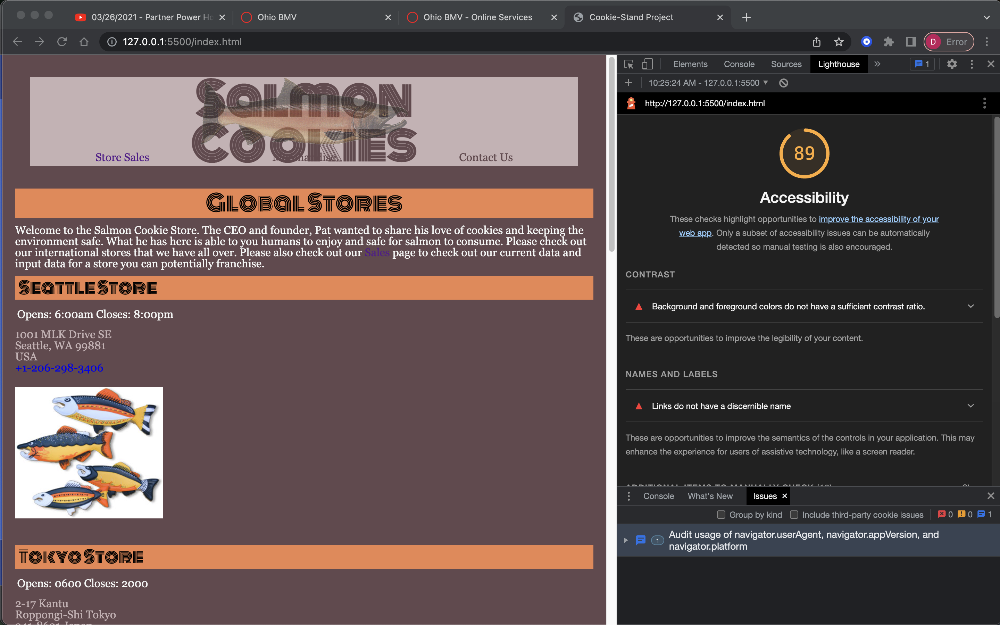
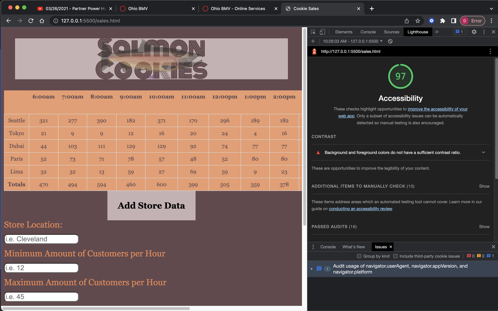

# Lab 06

## Cookie Stand

Purpose of Lab

### Author

Created By: Dasha Burgos  
Assisted By: Audrey (Instructor); Tony (TA); Matt (TA); Justin(TA), Reece(eventListener)

### Links and Resources

* [Class 06 Demo - Object Literals and DOM](https://github.com/codefellows/seattle-code-201d97/blob/main/class-06/inclass-demo/js/app.js)
* [MDN-Math.Random](https://developer.mozilla.org/en-US/docs/Web/JavaScript/Reference/Global_Objects/Math/random)
* [CSS Table Formatting](https://www.w3schools.com/css/css_table.asp)
* [Class 07 Demo - for Constructors and Prototypes](https://github.com/codefellows/seattle-code-201d97/blob/main/class-07/inclass-demo/js/app.js)
* [CSS](https://www.w3schools.com/css/default.asp)
* [Color Scheme Generator](http://colormind.io/bootstrap/)

### Lighthouse Accessibility Report

### Reflections and Comments

CSS is not applied as easily as it is in theory. the color scheme is nice but I need to work on applying everything better. CSS is my weakness.
